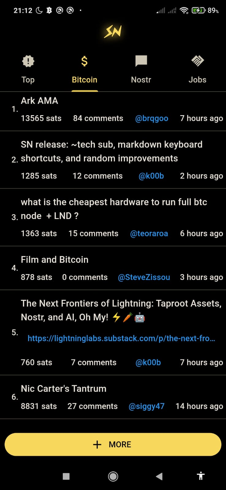
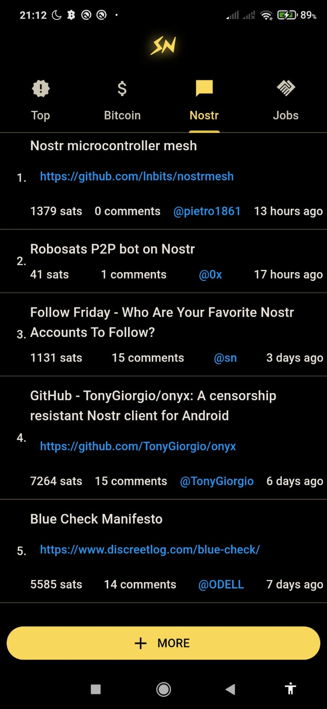
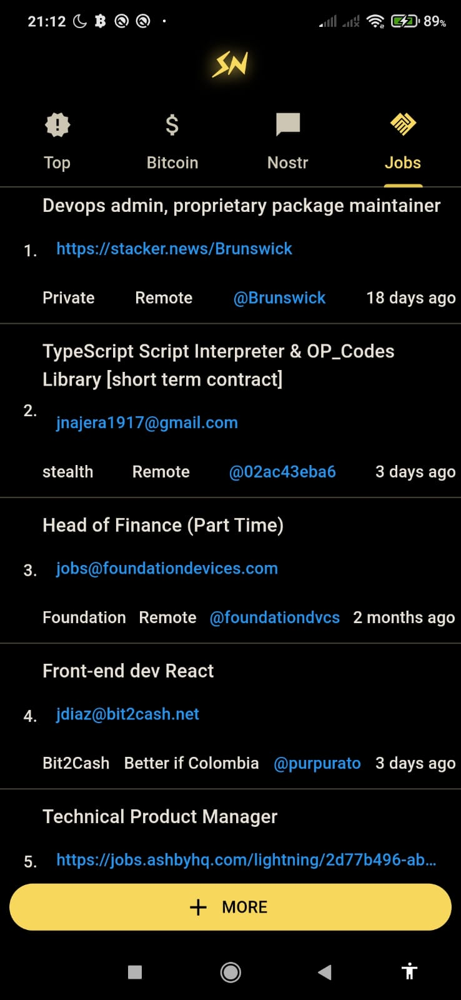
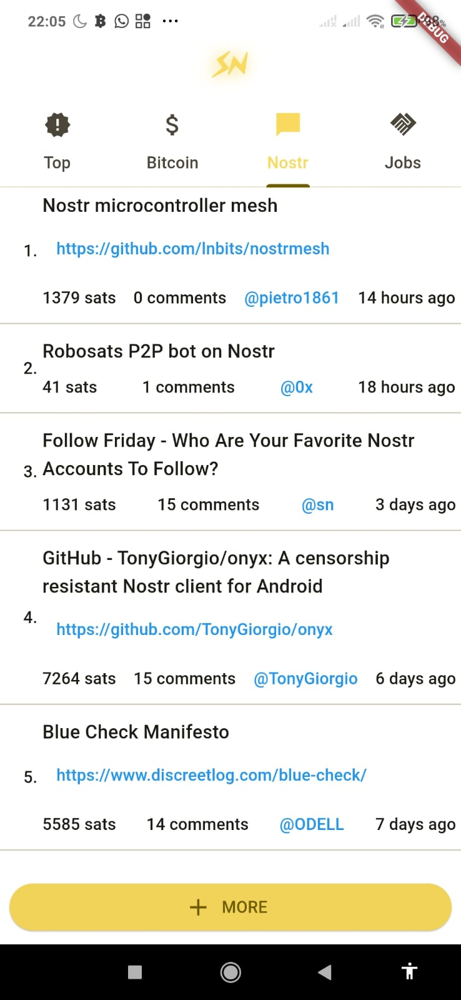

# Stacker News

Unofficial cross-platform Stacker News app written in Flutter.

I started this project as a Hacker News app in the begining of 2020 to learn the Bloc pattern. I still maintain the HN app but I'm now focusing on Stacker News.

The code is really hacky and fragile but it works. I'll be slowly refactoring the code to make it more robust and easier to work maintain.

Get the latest APK from the [Releases Section](https://github.com/felipebueno/stacker_news/releases/latest).

## Screenshots

### Dark Theme

  
  
  
  
  
  
  

### Light Theme

  
  
  
  
  
  

Not implemented yet.

## TODO

- [ ] Write a better TODO list

- [ ] Code

  - [x] Solve/circumvent the issue with the changing `_next/data/xyz` endpoint

  - [ ] Move away from the bloc pattern to something more simple

  - [ ] Refactor the code

  - [ ] Add tests

- [ ] App

  - [ ] Load more posts

  - [ ] Fix mardown rendering issues

  - [ ] Search

  - [ ] Better light theme

  - [ ] Theme switcher

  - [ ] More themes

  - [ ] About

    - [ ] Add link to source code

    - [ ] Donations

  - [ ] Login / Logout

    - [ ] Profile (show, edit)

    - [ ] Bookmarks

    - [ ] Post

    - [ ] Commenting

    - [ ] Zaps

  - [ ] Search

  - [ ] More subs / filters (tech, hot, recent, etc)

- [ ] Releases

  - [ ] Android release

    - [ ] Google Play

    - [ ] F-Droid

    - [ ] etc?

  - [ ] iOS release (will Apple allow this?)

  - [ ] Linux release

    - [ ] Snap

    - [ ] Flatpak

    - [ ] deb

    - [ ] etc?

  - [ ] Windows release

  - [ ] macOS release

  - [ ] Web (pwa) release (is this necessary?)
