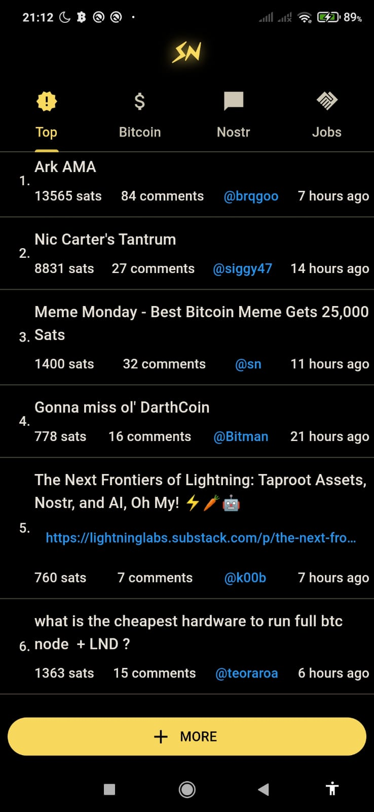
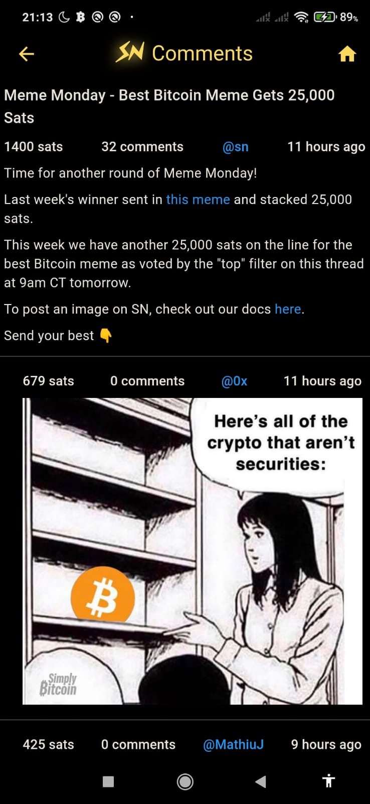

# Stacker News

Unofficial cross-platform Stacker News app written in Flutter.

This project started as a Hacker News app I developed in the begining of 2020 to learn the Bloc pattern. I still maintain the HN app but I'm now focusing on Stacker News.

## Screenshots

### Dark Theme

  
  
  
  
  
  

### Light Theme

Not implemented yet.

## TODO

- About

  - Add link to source code

  - Donations

- Login / Logout

  - Profile (show, edit)

  - Bookmarks

  - Post

  - Commenting

  - Zaps

- Search

- More subs / filters (tech, hot, recent, etc)

- iOS release

- Linux release

- Windows release

- macOS release

- Web (pwa) release (is this necessary?)
