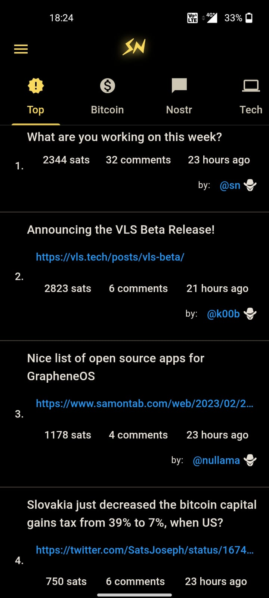
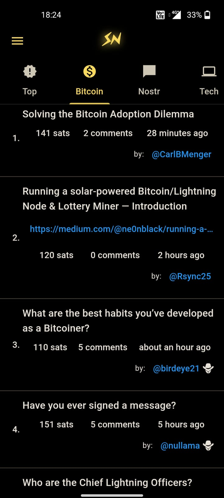
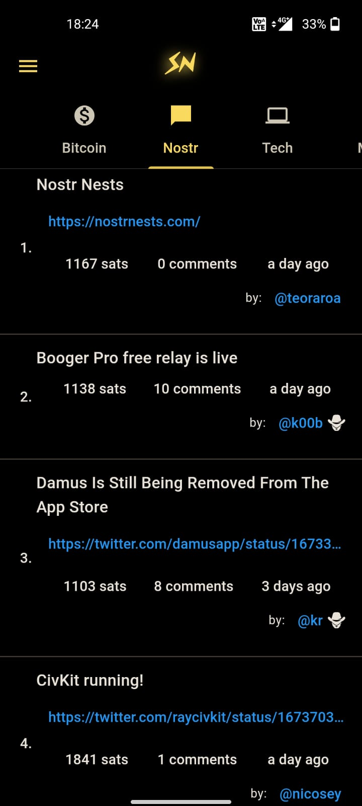
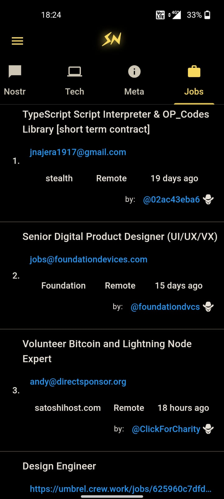
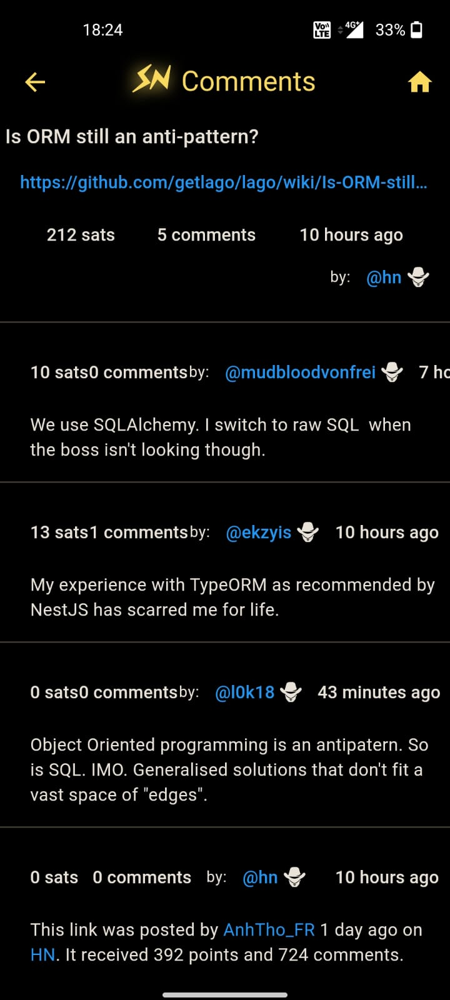
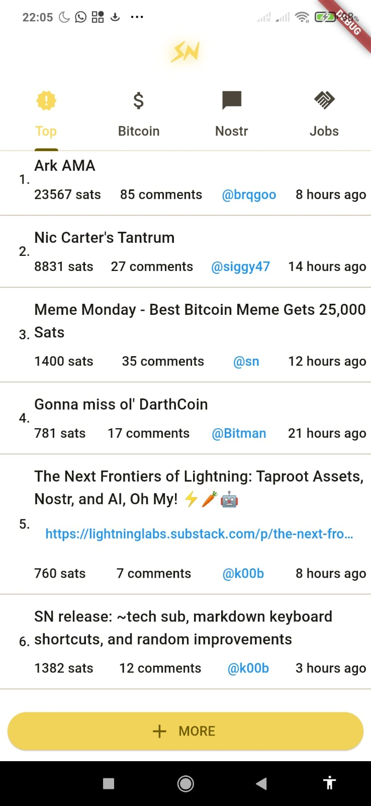
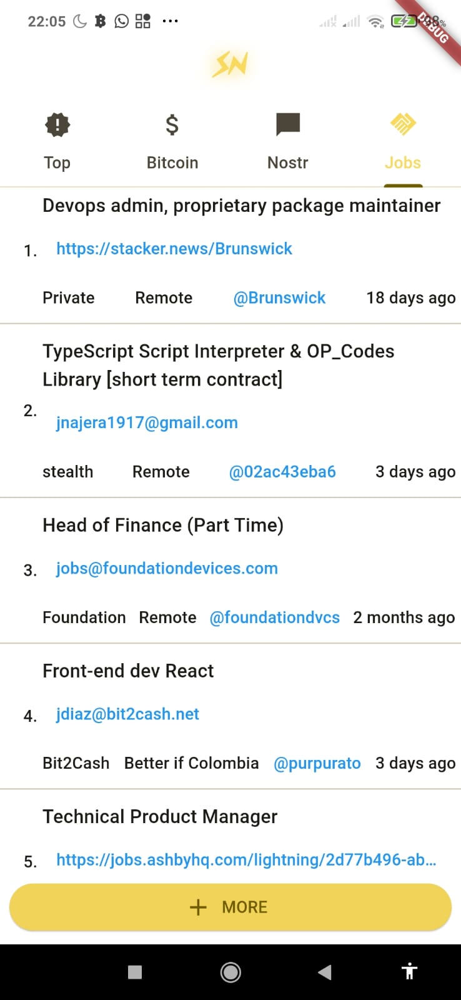
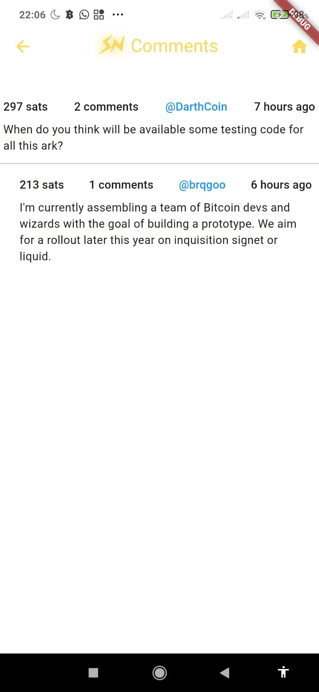

# Stacker News

Unofficial cross-platform Stacker News app written in Flutter.

I started this project as a Hacker News app in the begining of 2020 to learn the Bloc pattern. I still maintain the HN app but I'm now focusing on Stacker News.

The code is really hacky and fragile but it (mostly) works. I'll be slowly refactoring the code to make it more robust and easier to maintain.

Get the latest APK from the [Releases Section](https://github.com/felipebueno/stacker_news/releases/latest).

## Screenshots

### Dark Theme

  
  
  
  
  
  

### Light Theme

  
  
  
  
  
  

Not implemented yet.

## TODO

- [ ] Write a better TODO list

- [ ] Update screenshots [Issue 14](https://github.com/felipebueno/stacker_news/issues/14)

- [ ] Code

  - [x] Solve/circumvent the issue with the changing `_next/data/xyz` endpoint

  - [x] Move away from the bloc pattern to something more simple

  - [ ] Properly handle errors

  - [ ] Build a propper api client [issue 15](https://github.com/felipebueno/stacker_news/issues/15)

  - [ ] Add tests

- [ ] App

  - [ ] Open stacker.news links in the app

  - [x] Load more posts [issue 3](https://github.com/felipebueno/stacker_news/issues/3)

  - [x] Fix major markdown rendering issues

  - [x] Android [in_app_update](https://pub.dev/packages/in_app_update)

    - [ ] Handle in_app_update errors

  - [x] Light theme

  - [ ] Better Light theme

  - [x] Theme switcher

  - [ ] More themes

  - [x] About

    - [x] Add link to source code

    - [x] Donations

    - [ ] Aknowledgements

  - [x] Profile (show)

    - [x] Tap yellow button to tip

  - [ ] Login / Logout

    - [ ] Profile (edit)

    - [ ] Settings (edit)

    - [ ] Bookmarking

    - [ ] Push Notifications

    - [ ] Post

    - [x] Comment

    - [x] Zaps posts

    - [x] Zaps comments

    - [ ] Notifications (hasNewNotes icon, notifications page)

    - [ ] Replace deprecated uni_links with flutter_appauth or app_links

  - [ ] Search

  - [x] More subs (tech, meta)

  - [ ] More more subs (territories)

  - [ ] Filters (hot, recent, top)

- [ ] Releases

  - [ ] Github Actions

    - [x] PWA

    - [x] Google Play

    - [x] Github Releases

    - [ ] F-droid?

  - [ ] Android release

    - [ ] Instructions on how to build & install it yourself

    - [ ] Instructions on how to install it directly from github

    - [x] Put it back on Google Play

    - [ ] F-Droid (need help)

    - [ ] etc?

  - [ ] iOS release (will Apple allow this?) (need help)

  - [ ] Linux release

    - [ ] Snap

    - [ ] Flatpak

    - [ ] deb

    - [ ] etc?

  - [ ] Windows release

  - [ ] macOS release

  - [ ] Web (pwa) release (github pages?)
